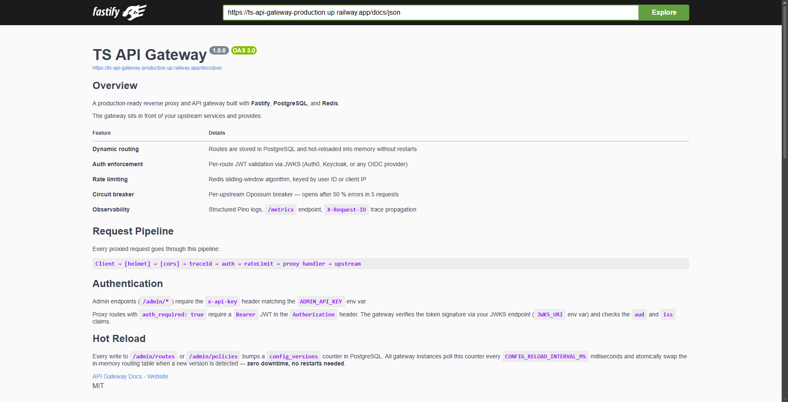

# ts-api-gateway

> A production-ready **API Gateway** built with Node.js, TypeScript, and Fastify.
> Implements routing, authentication (JWT/JWKS), Redis rate limiting, circuit breakers, distributed tracing, response caching, canary traffic splitting, upstream health monitoring, config hot reload, and full observability.

[](https://github.com/marcos-astudillo/ts-api-gateway/actions)


---

## API Preview

Swagger UI for testing the API gateway endpoints.

<p align="center">
  
</p>

---

## Table of Contents

- [Features](#features)
- [Architecture](#architecture)
- [Tech Stack](#tech-stack)
- [Project Structure](#project-structure)
- [Resilience Features](#resilience-features)
- [Distributed Tracing](#distributed-tracing)
- [Response Caching](#response-caching)
- [Upstream Health Monitoring](#upstream-health-monitoring)
- [Canary Traffic Splitting](#canary-traffic-splitting)
- [API Docs (Swagger UI)](#api-docs-swagger-ui)
- [API Reference](#api-reference)
- [Environment Variables](#environment-variables)
- [Running Locally](#running-locally)
- [Docker](#docker)
- [Example Services](#example-services)
- [Load Testing](#load-testing)
- [Testing](#testing)
- [Deployment (Railway)](#deployment-railway)
- [Scaling Considerations](#scaling-considerations)
- [System Design Reference](#system-design-reference)

---

## Features

| Feature | Description |
|---|---|
| **Dynamic Routing** | Path-prefix matching with longest-match wins, loaded from PostgreSQL |
| **Auth (JWT/JWKS)** | Per-route JWT validation with cached JWKS key fetching |
| **Rate Limiting** | Redis sliding-window per route + per client (IP or user ID) |
| **Circuit Breaker** | Per-upstream opossum breaker — prevents cascading failures |
| **Retry Policy** | Automatic retries on network errors, timeouts, and 5xx responses |
| **Config Hot Reload** | Routes and policies reload without restart via DB version polling |
| **Distributed Tracing** | W3C `traceparent` + Zipkin B3 headers (`x-b3-traceid`, `x-b3-spanid`) — compatible with Jaeger/Tempo |
| **Response Caching** | Redis-backed GET/HEAD cache with per-route TTL, `X-Cache: HIT/MISS` headers |
| **Upstream Health** | Background HEAD prober, consecutive-failure tracking, circuit-state integration |
| **Canary Splitting** | Weighted per-request coin flip; per-upstream circuit breakers for stable and canary |
| **Observability** | Structured JSON logs (pino), `/metrics`, `/healthz`, `/readyz`, `/admin/upstreams` |
| **Admin API** | REST API to manage routes, policies, and observe upstream health at runtime |

**Feature flags** (set in `.env`):

| Flag | Default | Description |
|---|---|---|
| `RATE_LIMIT_ENABLED` | `true` | Toggle rate limiting on/off |
| `CACHE_ENABLED` | `false` | Enable Redis response caching |
| `UPSTREAM_HEALTH_ENABLED` | `false` | Enable background upstream health probing |
| `FEATURE_CANARY_RELEASES` | `false` | Enable weighted canary traffic splitting |
| `FEATURE_ANALYTICS` | `false` | Enable analytics event emission (future) |

---

## Architecture

```
Client → TLS Termination / L4 LB → Gateway Instances (stateless) → Upstream Services
                                            ↕                ↕
                                       PostgreSQL          Redis
                                    (config store)  (rate limits + cache)
```

See full diagrams in [`docs/diagrams/`](./docs/diagrams/):
- [Architecture diagram](./docs/diagrams/architecture.md)
- [Data model](./docs/diagrams/data-model.md)
- [Request flow](./docs/diagrams/request-flow.md)

**Request middleware pipeline** (in order):
```
→ traceparent / B3 tracing (W3C trace propagation)
→ auth (JWT validation if route policy requires it)
→ rate limit (Redis sliding window)
→ cache lookup (Redis GET — serves cached response on HIT)
→ route matching (longest prefix)
→ canary selection (weighted coin flip if FEATURE_CANARY_RELEASES=true)
→ circuit breaker (per upstream)
→ retry policy + AbortSignal timeout (upstream-client)
→ undici HTTP proxy
→ cache store (Redis SETEX on 2xx — onSend hook)
→ metrics recording
→ response + traceparent header
```

---

## Tech Stack

| Layer | Technology |
|---|---|
| Runtime | Node.js 20 |
| Language | TypeScript 5 |
| HTTP Framework | Fastify 4 |
| Database | PostgreSQL 16 |
| Cache / Rate limiting | Redis 7 |
| HTTP Proxy | undici (Node.js built-in) |
| Circuit Breaker | opossum |
| Auth | jsonwebtoken + jwks-rsa |
| Validation | Zod |
| Logging | pino |
| API Docs | @fastify/swagger + @fastify/swagger-ui (OpenAPI 3.0) |
| Testing | Vitest |
| Container | Docker (multi-stage) |
| CI/CD | GitHub Actions |
| Hosting | Railway |

---

## Project Structure

```
ts-api-gateway/
├── src/
│   ├── config/           # env validation, DB pool, Redis client
│   ├── controllers/      # Admin API request handlers
│   ├── middlewares/      # trace-id (W3C+B3), auth, rate-limit, cache, admin-auth, error handler
│   ├── models/           # TypeScript interfaces (Route w/ canary, Policy w/ cacheTtl)
│   ├── repositories/     # Typed PostgreSQL access layer
│   ├── routes/           # Fastify route registrations
│   │   ├── admin.routes.ts       # + GET /admin/upstreams
│   │   ├── health.routes.ts
│   │   └── proxy.routes.ts       ← catch-all proxy (canary-aware)
│   ├── schemas/          # JSON Schema / OpenAPI objects for Swagger docs
│   ├── services/
│   │   ├── auth/         # JWT verification + JWKS caching
│   │   ├── cache/        # Redis response cache (buildCacheKey, getCached, setCached)
│   │   ├── health/       # Upstream health prober + in-memory healthMap
│   │   ├── metrics/      # In-process request/latency metrics
│   │   ├── proxy/        # undici proxy + circuit breaker + retry + traffic splitter
│   │   │   ├── http-proxy.ts         # Core undici wrapper
│   │   │   ├── upstream-client.ts    # Retry + AbortSignal.timeout per attempt
│   │   │   ├── circuit-breaker.ts    # Per-upstream opossum breaker registry
│   │   │   ├── retry-policy.ts       # isRetryableError, isRetryableStatus, executeWithRetry
│   │   │   └── traffic-splitter.ts   # selectUpstream — weighted canary coin flip
│   │   ├── ratelimit/    # Redis sliding window
│   │   └── router/       # Route matcher + in-memory config cache
│   ├── types/            # Module augmentations (requestContext + spanId, cacheKey, cacheTtl)
│   ├── app.ts            # Fastify app factory (testable without port binding)
│   ├── logger.ts         # pino structured logger
│   └── server.ts         # Entry point — binds port, graceful shutdown
├── tests/
│   ├── helpers/          # DB setup/teardown for integration tests
│   ├── unit/             # Route matcher, rate limiter, metrics, resilience
│   ├── integration/      # Admin API, proxy routing
│   └── load/             # k6 smoke / load / stress scripts
├── example-services/
│   ├── users/server.js   # Minimal users upstream (Node.js, no deps)
│   ├── orders/server.js  # Minimal orders upstream — run two instances for canary demo
│   ├── setup.sh          # Registers example routes + policies via Admin API
│   └── README.md
├── docs/diagrams/        # Architecture, data model, request flow (Mermaid)
├── scripts/
│   └── migrate.ts        # Database migration runner (migrations 1–6)
├── docker/
│   └── Dockerfile        # Multi-stage build
├── .github/workflows/
│   └── ci.yml            # Typecheck → lint → test → build → deploy
├── docker-compose.yml    # Full local stack: gateway + postgres + redis + example services
├── railway.toml          # Railway deployment config
└── .env.example          # All environment variables documented
```

---

## Resilience Features

Every upstream request passes through a three-layer resilience stack before the gateway returns an error to the client.

```
proxy handler → circuit breaker → retry policy → AbortSignal timeout → upstream
```

### Circuit Breaker

Implemented with [opossum](https://nodeshift.dev/opossum/).
One breaker is maintained **per unique upstream** (`host:port`).

| State | Behaviour |
|---|---|
| **CLOSED** | Normal operation — all requests pass through |
| **OPEN** | Upstream is unhealthy — requests fail-fast with `503` (no network call made) |
| **HALF-OPEN** | After `CIRCUIT_BREAKER_RESET_TIMEOUT_MS`, one probe request is allowed through |

If the probe succeeds the circuit **closes**; if it fails the circuit **reopens**.

All state transitions are logged at `warn`/`info` level and reflected in the `/metrics` endpoint under `circuit_breakers`.

**Configuration:**

| Variable | Default | Description |
|---|---|---|
| `CIRCUIT_BREAKER_ERROR_THRESHOLD_PERCENT` | `50` | % failures (within rolling window) needed to open |
| `CIRCUIT_BREAKER_RESET_TIMEOUT_MS` | `10000` | Milliseconds to wait in OPEN before probing |

**Response when circuit is open:**
```json
{ "error": "upstream_unavailable", "message": "Service temporarily unavailable" }
```

### Retry Policy

Automatic retries on transient failures, **inside** the circuit breaker. The breaker sees only the final outcome — individual retry attempts are invisible to it, so recoverable blips don't count against the error threshold.

**Retried on:**
- Network errors: `ECONNREFUSED`, `ECONNRESET`, `ETIMEDOUT`, undici socket errors
- Timeout errors: `TimeoutError` / `AbortError` from `AbortSignal.timeout()`
- 5xx upstream responses: `500`–`599`

**Not retried on:** 4xx responses (client errors — retrying won't change the outcome).

**Retry budget:** set per-route via the `retries` field in `POST /admin/routes` (default `2` — up to 3 total attempts).

```json
{ "retries": 2 }
```

### Request Timeout

Each individual attempt gets a hard wall-clock deadline via [`AbortSignal.timeout()`](https://nodejs.org/api/globals.html#abortsignaltimeoutdelay) — a fresh signal is created per attempt so a timed-out first attempt does not bleed into the retry's deadline.

Timeout values are configured per-route:

```json
{ "timeouts_ms": { "connect": 200, "request": 3000 } }
```

| Field | Description |
|---|---|
| `connect` | Max time to establish TCP connection and receive response headers |
| `request` | Max wall-clock time for the entire request (connect + body) — enforced via `AbortSignal` |

**Response when upstream times out:**
```json
{ "error": "upstream_timeout", "message": "Upstream did not respond in time" }
```

### Observability

All resilience events emit structured log entries:

| Event | Level | Fields |
|---|---|---|
| Circuit opens | `warn` | `upstream`, message |
| Circuit closes | `info` | `upstream`, message |
| Circuit half-open | `info` | `upstream`, message |
| Upstream failure recorded | `error` | `upstream`, `err` |
| Retry attempt | `warn` | `upstream`, `route`, `attempt`, `maxRetries`, `reason` |

---

## Distributed Tracing

The gateway implements **W3C Trace Context** (`traceparent`) and **Zipkin B3** headers natively — no sidecar required. It integrates out-of-the-box with Jaeger, Grafana Tempo, and any OpenTelemetry-compatible backend.

### How it works

1. If the incoming request carries a `traceparent` header, the gateway **extracts** the trace ID and parent span ID.
2. If not, a **new 128-bit trace ID** and **64-bit span ID** are generated using `crypto.randomBytes`.
3. A fresh span ID is always generated for the gateway's own span.
4. The following headers are **propagated to the upstream**:
   - `traceparent: 00-{traceId32hex}-{spanId16hex}-01`
   - `x-b3-traceid`, `x-b3-spanid`, `x-b3-sampled: 1`
   - `x-request-id` (backwards compatibility)
5. `traceparent` is echoed back to the client in the response.

### Connecting to Jaeger

```bash
# Run Jaeger all-in-one locally
docker run -d --name jaeger \
  -p 16686:16686 \
  -p 4317:4317 \
  jaegertracing/all-in-one:latest

# The gateway emits traceparent — configure your upstreams to forward it to Jaeger
# Open http://localhost:16686 to browse traces
```

> The gateway itself does not call the Jaeger/OTLP API — it propagates headers so that each microservice can report its own spans. To report gateway spans directly, add an OpenTelemetry SDK integration.

---

## Response Caching

Redis-backed response caching for idempotent routes (`GET` and `HEAD`). Serves cached responses without touching the upstream until TTL expires.

### Enable caching

```bash
# .env
CACHE_ENABLED=true
CACHE_DEFAULT_TTL_SECONDS=60   # optional global default
```

Set per-route TTL via the policy API:
```bash
curl -X POST http://localhost:3000/admin/policies \
  -H "x-api-key: $ADMIN_API_KEY" \
  -H "content-type: application/json" \
  -d '{"route":"users","cache_ttl_seconds":120}'
```

### Cache behaviour

| Condition | Result |
|---|---|
| `CACHE_ENABLED=false` | Caching disabled entirely |
| Method is not `GET` or `HEAD` | Bypassed |
| Request has `Authorization` header | Bypassed (user-specific response) |
| Request has `Cache-Control: no-cache` or `no-store` | Bypassed |
| Route has no TTL (policy or global default) | Bypassed |
| Upstream returns `Cache-Control: no-store` | Not stored |
| Upstream returns non-2xx | Not stored |

### Response headers

| Header | Value | Description |
|---|---|---|
| `X-Cache` | `HIT` / `MISS` | Whether the response was served from cache |
| `X-Cache-Age` | seconds | Age of the cached entry (only on HIT) |

### Cache invalidation

```bash
# Via Admin API — invalidates all cached responses for a route
# (Built into the cache.service.ts invalidateRoute() function)
# Can be called after a deployment to flush stale responses
```

---

## Upstream Health Monitoring

A background loop periodically sends a lightweight `HEAD /` probe to every registered upstream. Results are surfaced via `GET /admin/upstreams`.

### Enable health monitoring

```bash
# .env
UPSTREAM_HEALTH_ENABLED=true
UPSTREAM_HEALTH_CHECK_INTERVAL_MS=30000   # probe every 30 s
UPSTREAM_HEALTH_TIMEOUT_MS=3000           # per-probe timeout
```

### Health status values

| Status | Meaning |
|---|---|
| `healthy` | Probe succeeded, latency ≤ 2 000 ms |
| `degraded` | Probe succeeded but latency > 2 000 ms, or first failure |
| `unhealthy` | 3+ consecutive probe failures |
| `unknown` | No probe has run yet |

### View upstream health

```bash
curl http://localhost:3000/admin/upstreams \
  -H "x-api-key: $ADMIN_API_KEY"
```

Example response:
```json
[
  {
    "upstream": "orders.svc:8080",
    "status": "healthy",
    "latencyMs": 14,
    "consecutiveFailures": 0,
    "lastCheckedAt": "2024-01-15T10:30:00.000Z",
    "circuitBreaker": "closed"
  }
]
```

---

## Canary Traffic Splitting

Route a configurable percentage of traffic to a canary upstream while the rest goes to the stable upstream. Each variant has its own independent circuit breaker.

### Enable canary

```bash
# .env
FEATURE_CANARY_RELEASES=true
```

### Register a route with canary

```bash
curl -X POST http://localhost:3000/admin/routes \
  -H "x-api-key: $ADMIN_API_KEY" \
  -H "content-type: application/json" \
  -d '{
    "name": "orders",
    "match": { "path_prefix": "/v1/orders" },
    "upstream": { "host": "orders.svc", "port": 8080 },
    "canary": {
      "upstream": { "host": "orders-canary.svc", "port": 8090 },
      "weight": 10
    }
  }'
```

This sends **10 %** of `/v1/orders` traffic to `orders-canary.svc:8090` and **90 %** to `orders.svc:8080`.

### How the selection works

```
Math.random() * 100 < canaryWeight  →  canary
otherwise                           →  stable
```

The selection is **stateless and per-request**. For sticky sessions (always show canary to the same user), key the decision on the user ID from the request context.

### Verify canary routing

Check the `x-service-version` header returned by the example services:
```bash
for i in $(seq 1 20); do
  curl -s http://localhost:3000/v1/orders | python3 -c \
    "import sys, json; print(json.load(sys.stdin)['version'])"
done
```

---

## Live API

This service is deployed on Railway and exposes public documentation, health monitoring, and metrics endpoints.

<p align="center">
  <a href="https://ts-api-gateway-production.up.railway.app/docs">
    
  </a>
  <a href="https://ts-api-gateway-production.up.railway.app/healthz">
    
  </a>
  <a href="https://ts-api-gateway-production.up.railway.app/readyz">
    
  </a>
  <a href="https://ts-api-gateway-production.up.railway.app/metrics">
    
  </a>
</p>

---

## API Docs (Swagger UI)

The gateway ships with an interactive **OpenAPI 3.0** UI powered by `@fastify/swagger` and `@fastify/swagger-ui`.

| URL | Description |
|---|---|
| `GET /docs` | Swagger UI — try every endpoint in the browser |
| `GET /docs/json` | Raw OpenAPI 3.0 spec (JSON) |
| `GET /docs/yaml` | Raw OpenAPI 3.0 spec (YAML) |

**Start the server and open the docs:**
```bash
npm run dev
open http://localhost:3000/docs
```

The interactive UI lets you:
- **Browse** every admin and health endpoint with full parameter descriptions and example values
- **Authenticate** — click 🔒 *Authorize* and enter your `ADMIN_API_KEY` to unlock admin endpoints
- **Try it out** — execute real requests directly from the browser and see live responses
- **Inspect schemas** — expand any request/response model to see field-level descriptions and constraints

> **Tip:** In production you may want to restrict access to `/docs` by placing it behind your VPN or
> removing the swagger plugins from the production build. The raw spec at `/docs/json` can be imported
> into Postman, Insomnia, or any OpenAPI-compatible tooling.

### OpenAPI Spec highlights

#### Security schemes

| Scheme | Header | Used by |
|---|---|---|
| `ApiKeyAuth` | `x-api-key` | All `/admin/*` endpoints |
| `BearerAuth` | `Authorization: Bearer <jwt>` | Proxied routes with `auth_required: true` |

#### Tags

| Tag | Endpoints |
|---|---|
| **Admin: Routes** | `GET/POST /admin/routes`, `GET/PUT/DELETE /admin/routes/:id` |
| **Admin: Policies** | `GET/POST /admin/policies`, `DELETE /admin/policies/:id` |
| **Health** | `/healthz`, `/readyz`, `/metrics` |

---

## API Reference

### Admin API

All admin endpoints require the `x-api-key` header.
> 💡 The full interactive reference with live request execution is available at [`/docs`](http://localhost:3000/docs) when the server is running.

#### Routes

| Method | Path | Description |
|---|---|---|
| `GET` | `/admin/routes` | List all routes |
| `POST` | `/admin/routes` | Create a route |
| `GET` | `/admin/routes/:id` | Get route by ID |
| `PUT` | `/admin/routes/:id` | Update a route |
| `DELETE` | `/admin/routes/:id` | Delete a route |

**Create route — `POST /admin/routes`**
```json
{
  "name": "orders",
  "match": { "path_prefix": "/v1/orders" },
  "upstream": { "host": "orders.svc", "port": 8080 },
  "strip_path": false,
  "timeouts_ms": { "connect": 200, "request": 2000 },
  "retries": 2,
  "canary": {
    "upstream": { "host": "orders-canary.svc", "port": 8090 },
    "weight": 10
  }
}
```

#### Policies

| Method | Path | Description |
|---|---|---|
| `GET` | `/admin/policies` | List all policies |
| `POST` | `/admin/policies` | Create or update a policy |
| `DELETE` | `/admin/policies/:id` | Delete a policy |

**Create policy — `POST /admin/policies`**
```json
{
  "route": "orders",
  "auth_required": true,
  "rate_limit": { "rps": 50, "burst": 100 },
  "cache_ttl_seconds": 60
}
```

#### Upstream Health

| Method | Path | Description |
|---|---|---|
| `GET` | `/admin/upstreams` | Snapshot of all upstream health entries |

### Observability

| Method | Path | Description |
|---|---|---|
| `GET` | `/healthz` | Liveness probe — always 200 |
| `GET` | `/readyz` | Readiness probe — checks DB + Redis |
| `GET` | `/metrics` | Request counts, latency histogram, circuit breaker state |

### Proxy

All other paths are matched against registered routes and proxied to the configured upstream.

```
GET /v1/orders/123
→ matched by route with path_prefix: /v1/orders
→ forwarded to http://orders.svc:8080/v1/orders/123
```

**Response headers always include:**
- `traceparent` — W3C trace context (echoed back to client)
- `x-request-id` — trace ID (backwards compatibility)
- `X-RateLimit-Limit`, `X-RateLimit-Remaining`, `X-RateLimit-Reset`
- `X-Cache: HIT|MISS` — cache status (when `CACHE_ENABLED=true`)

---

## Environment Variables

Copy `.env.example` to `.env` and fill in the required values:

```bash
cp .env.example .env
```

| Variable | Required | Default | Description |
|---|---|---|---|
| `DATABASE_URL` | ✅ | — | PostgreSQL connection string |
| `REDIS_URL` | ✅ | — | Redis connection string |
| `ADMIN_API_KEY` | ✅ | — | Secret for `/admin/*` endpoints (min 16 chars) |
| `PORT` | | `3000` | Server port |
| `LOG_LEVEL` | | `info` | `trace\|debug\|info\|warn\|error` |
| `JWKS_URI` | | — | JWKS endpoint for JWT validation |
| `JWT_AUDIENCE` | | `api-gateway` | Expected JWT audience claim |
| `JWT_ISSUER` | | — | Expected JWT issuer claim |
| `JWKS_CACHE_TTL_SECONDS` | | `600` | How long to cache JWKS public keys |
| `RATE_LIMIT_ENABLED` | | `true` | Toggle rate limiting |
| `RATE_LIMIT_DEFAULT_RPS` | | `100` | Default RPS when route has no policy |
| `RATE_LIMIT_DEFAULT_BURST` | | `200` | Default burst when route has no policy |
| `CONFIG_RELOAD_INTERVAL_MS` | | `5000` | How often to poll for config changes |
| `CIRCUIT_BREAKER_TIMEOUT_MS` | | `3000` | Per-request timeout inside breaker |
| `CIRCUIT_BREAKER_ERROR_THRESHOLD_PERCENT` | | `50` | Error % to open the breaker |
| `CIRCUIT_BREAKER_RESET_TIMEOUT_MS` | | `10000` | Wait before probing after open |
| `CACHE_ENABLED` | | `false` | Enable Redis response caching |
| `CACHE_DEFAULT_TTL_SECONDS` | | `0` | Global cache TTL (0 = per-route policy only) |
| `UPSTREAM_HEALTH_ENABLED` | | `false` | Enable background upstream health probing |
| `UPSTREAM_HEALTH_CHECK_INTERVAL_MS` | | `30000` | Probe interval in milliseconds |
| `UPSTREAM_HEALTH_TIMEOUT_MS` | | `3000` | Per-probe HTTP timeout |
| `FEATURE_CANARY_RELEASES` | | `false` | Enable weighted canary traffic splitting |
| `FEATURE_ANALYTICS` | | `false` | Enable analytics (future) |

---

## Running Locally

**Prerequisites:** Node.js 20+, Docker (for PostgreSQL + Redis)

```bash
# 1. Clone and install
git clone https://github.com/YOUR_USERNAME/ts-api-gateway
cd ts-api-gateway
npm install

# 2. Start infrastructure
docker compose up postgres redis -d

# 3. Configure environment
cp .env.example .env
# Set ADMIN_API_KEY=my-dev-secret-key-12345

# 4. Run migrations
npm run db:migrate

# 5. Start the dev server (hot-reload)
npm run dev
```

The gateway is now listening at `http://localhost:3000`.

**Quick smoke test:**
```bash
# Health check
curl http://localhost:3000/healthz

# Create a route (requires running upstream)
curl -X POST http://localhost:3000/admin/routes \
  -H "x-api-key: my-dev-secret-key-12345" \
  -H "content-type: application/json" \
  -d '{"name":"httpbin","match":{"path_prefix":"/test"},"upstream":{"host":"httpbin.org","port":80}}'

# Proxy a request
curl http://localhost:3000/test/get
```

---

## Docker

**Build and run everything with Docker Compose:**

```bash
# Build and start all services
docker compose up --build

# Run only infrastructure (develop gateway locally)
docker compose up postgres redis -d

# Stop everything
docker compose down -v
```

**Build production image only:**
```bash
docker build -f docker/Dockerfile -t ts-api-gateway .
docker run -p 3000:3000 \
  -e DATABASE_URL=... \
  -e REDIS_URL=... \
  -e ADMIN_API_KEY=... \
  ts-api-gateway
```

The Dockerfile uses a **multi-stage build**:
1. `builder` — installs all deps, compiles TypeScript
2. `production` — copies only compiled JS + prod deps, runs as non-root user

---

## Example Services

Two zero-dependency Node.js services that act as realistic upstreams for local testing.

```bash
# Start all services (gateway + infra + example services)
docker compose up --build

# Register example routes, policies, and canary config
./example-services/setup.sh
```

Then try:
```bash
curl http://localhost:3000/users
curl http://localhost:3000/orders
curl http://localhost:3000/admin/upstreams -H "x-api-key: dev-admin-key-123456"
```

See [`example-services/README.md`](./example-services/README.md) for the full walkthrough.

---

## Load Testing

k6 load test scripts are in [`tests/load/`](./tests/load/).

```bash
# Install k6
brew install k6  # or: choco install k6

# Smoke test (1 VU, 30 s — sanity check)
k6 run tests/load/smoke.js

# Load test (0→20→0 VUs over 5 min — SLO validation)
k6 run tests/load/load.js

# Stress test (0→300→0 VUs over 10 min — break-point analysis)
k6 run tests/load/stress.js

# Against a remote environment
k6 run --env BASE_URL=https://gateway.staging.example.com tests/load/load.js
```

See [`tests/load/README.md`](./tests/load/README.md) for full details.

---

## Testing

```bash
# Run all tests once
npm test

# Watch mode (TDD)
npm run test:watch

# With coverage report
npm run test:coverage
```

**Test categories:**

| File | Type | What it tests |
|---|---|---|
| `tests/unit/route-matcher.test.ts` | Unit | Path matching, strip_path, edge cases |
| `tests/unit/rate-limiter.test.ts` | Unit | Redis sliding window (mocked Redis) |
| `tests/unit/metrics.test.ts` | Unit | Counter/histogram recording |
| `tests/unit/app.test.ts` | Unit | App bootstrap, health endpoints |
| `tests/unit/resilience.test.ts` | Unit | Retry policy, circuit breaker, timeout detection |
| `tests/integration/admin.test.ts` | Integration | Admin CRUD (real PostgreSQL) |
| `tests/integration/proxy.test.ts` | Integration | Proxy routing (real upstream server) |

**Integration tests** require running PostgreSQL and Redis (started automatically in CI, use Docker locally).

---

## Deployment (Railway)

> Requires a [Railway](https://railway.app) account and the Railway CLI.

```bash
# Install CLI
npm install -g @railway/cli

# Login
railway login

# Create project (first time)
railway init

# Add PostgreSQL and Redis plugins in the Railway dashboard

# Set required secrets
railway variables set ADMIN_API_KEY=your-secret-here
railway variables set JWKS_URI=https://your-auth.provider/.well-known/jwks.json

# Deploy
railway up
```

**Automatic deploys** via GitHub Actions are configured in `.github/workflows/ci.yml`.
Set the `RAILWAY_TOKEN` secret in your GitHub repository settings.

The deployment pipeline:
```
push to main → typecheck → lint → test → build → Docker build → Railway deploy
```

---

## Scaling Considerations

Based on the [system design](https://github.com/marcos-astudillo/system-design-notes):

| Concern | Solution |
|---|---|
| **High throughput (100k+ RPS)** | Horizontal scaling — add gateway instances behind L4 LB |
| **Stateless instances** | Config in PostgreSQL, rate-limit counters in Redis |
| **p95 latency < 10ms** | Fastify + undici + in-memory route cache (no DB on hot path) |
| **Config changes** | Versioned hot reload — no restart needed |
| **Upstream failures** | Circuit breakers prevent cascading failures |
| **JWKS bottleneck** | Public keys cached for `JWKS_CACHE_TTL_SECONDS` (default 10 min) |
| **Redis rate-limit latency** | Lua script = single round-trip; fail-open if Redis unavailable |
| **Heavy config pushes** | Staggered per-instance polling avoids thundering reload |
| **Availability (99.95%+)** | Multiple instances + health checks + graceful shutdown |

---

## System Design Reference

This implementation is based on the **API Gateway** system design from:

> 📐 [system-design-notes](https://github.com/marcos-astudillo/system-design-notes/blob/main/designs/api-gateway.md)

The design covers:
- Problem statement and functional requirements
- High-level architecture with Mermaid diagrams
- Data model and config versioning
- Scaling strategy and bottlenecks
- Trade-offs and possible improvements

---

## License

This project is licensed under the MIT License.

See the [LICENSE](LICENSE) file for details.

---

## 📫 Connect With Me

<p align="center">

  <a href="https://www.marcosastudillo.com">
    
  </a>

  <a href="https://www.linkedin.com/in/marcos-astudillo-c/">
    
  </a>

  <a href="https://github.com/marcos-astudillo">
    
  </a>

  <a href="mailto:m.astudillo1986@gmail.com">
    
  </a>

</p>