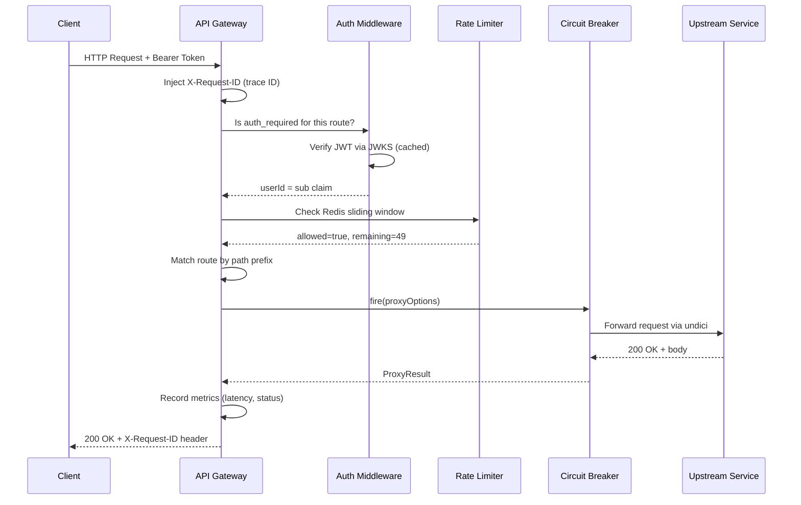
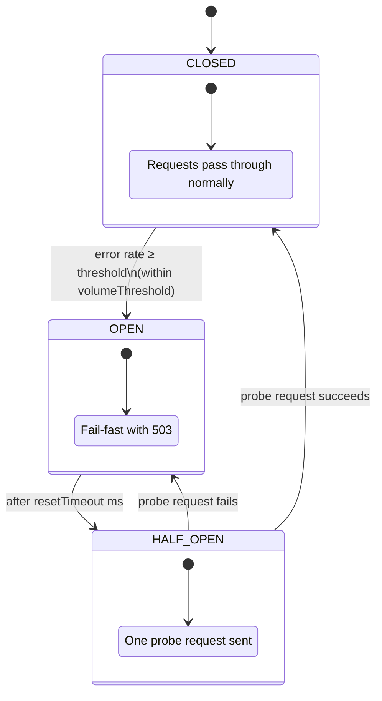

# Architecture Diagram

## High-Level System Architecture

```mermaid
flowchart LR
    C([Client]) -->|HTTPS| EDGE[TLS Termination\nL4 Load Balancer]
    EDGE -->|HTTP| GW1[Gateway Instance 1]
    EDGE -->|HTTP| GW2[Gateway Instance 2]
    EDGE -->|HTTP| GWN[Gateway Instance N]

    subgraph Gateway Cluster [Stateless Gateway Cluster]
        direction TB
        GW1 & GW2 & GWN
    end

    Gateway Cluster --> AUTH[Auth Middleware\nJWT + JWKS Cache]
    Gateway Cluster --> RL[Rate Limiter\nRedis Sliding Window]
    Gateway Cluster --> ROUTER[Route Matcher\nPath-Prefix Tree]

    ROUTER --> S1[Service A\ne.g. Orders :8080]
    ROUTER --> S2[Service B\ne.g. Users :8081]
    ROUTER --> S3[Service C\ne.g. Payments :8082]

    Gateway Cluster <-->|Config poll every 5s| DB[(PostgreSQL\nConfig Store)]
    Gateway Cluster <-->|Rate limit counters| REDIS[(Redis\nSlidingWindow)]
    Gateway Cluster --> OBS[Observability\n/metrics /healthz /readyz]

    style Gateway Cluster fill:#f0f4ff,stroke:#4f6ef7
    style DB fill:#e8f5e9,stroke:#43a047
    style REDIS fill:#fff3e0,stroke:#fb8c00
```

## Request Flow Through One Gateway Instance



## Circuit Breaker State Machine


