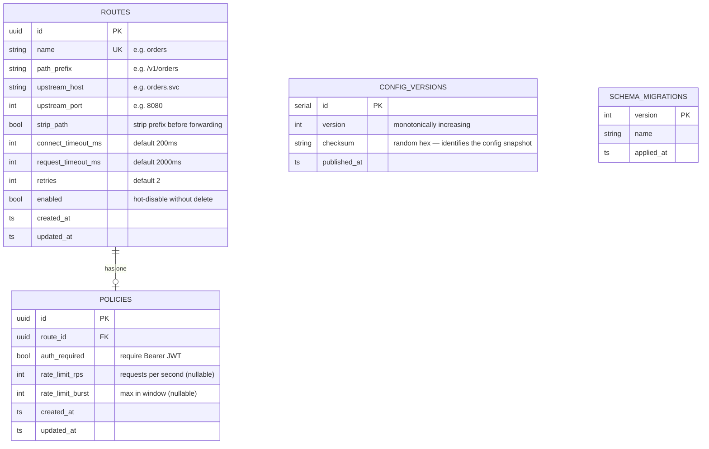
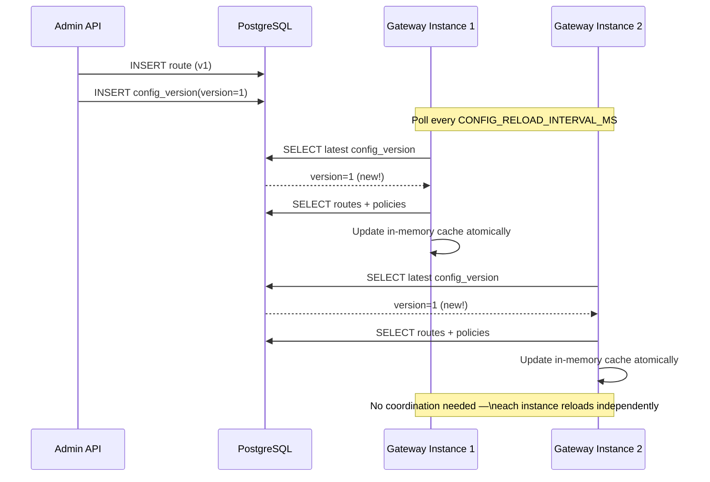

# Data Model

## Entity Relationship Diagram

## Config Version Flow

## Indexes

| Table            | Index                                    | Purpose                                          |
|------------------|------------------------------------------|--------------------------------------------------|
| `routes`         | `idx_routes_path_prefix`                 | Fast prefix scan during route matching           |
| `routes`         | `idx_routes_enabled`                     | Filter only active routes during config load     |
| `policies`       | `idx_policies_route_id`                  | O(1) policy lookup by route ID                   |
| `config_versions`| `idx_config_versions_version DESC`       | O(1) latest version fetch                        |
