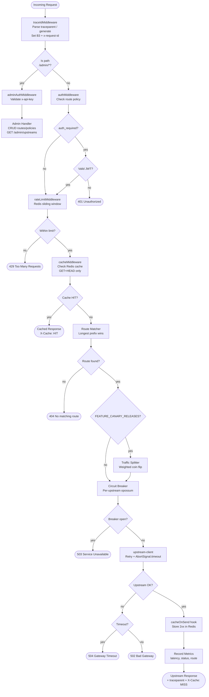
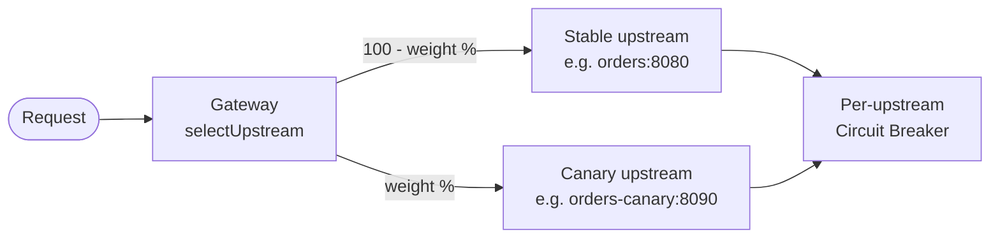
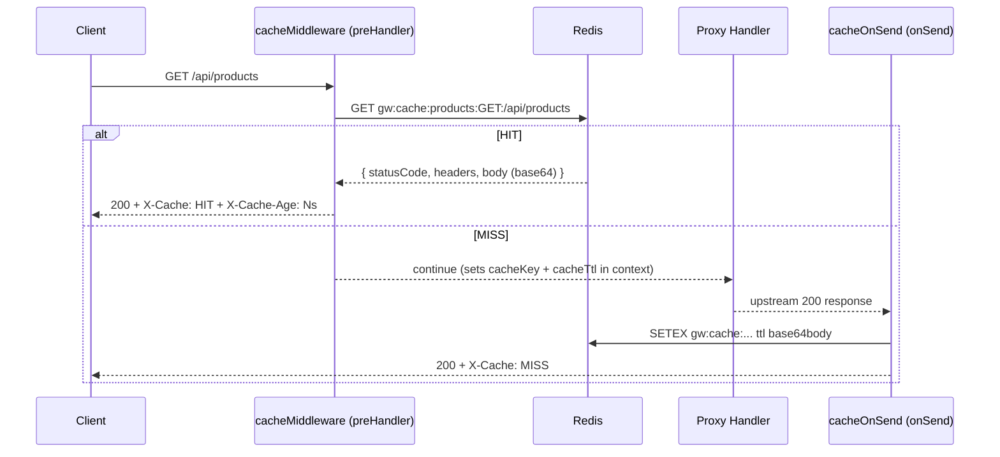

# Request Flow Diagrams

## Middleware Pipeline

Every request through the gateway traverses this pipeline in order:



## Rate Limiting: Sliding Window Algorithm


## Canary Traffic Splitting

Controlled by the `FEATURE_CANARY_RELEASES=true` flag. Per-route canary
configuration is stored in the `routes` table (`canary_upstream_host`,
`canary_upstream_port`, `canary_weight`).



The selection is a stateless weighted coin flip (`Math.random() * 100 < canaryWeight`).
Each upstream has its own independent circuit breaker.

## Upstream Health Monitoring

Background loop runs every `UPSTREAM_HEALTH_CHECK_INTERVAL_MS` ms
(requires `UPSTREAM_HEALTH_ENABLED=true`).

```mermaid
sequenceDiagram
    participant LOOP as Health Loop (background)
    participant UP as Upstream (HEAD /)
    participant MAP as In-Memory healthMap
    participant CB as Circuit Breaker Registry
    participant API as GET /admin/upstreams

    loop every UPSTREAM_HEALTH_CHECK_INTERVAL_MS
        LOOP->>UP: HEAD / (timeout: UPSTREAM_HEALTH_TIMEOUT_MS)
        UP-->>LOOP: latencyMs, ok
        LOOP->>CB: getAllBreakers() → state
        LOOP->>MAP: upsert { status, latencyMs, consecutiveFailures, circuitBreaker }
    end

    API->>MAP: getAllUpstreamHealth()
    MAP-->>API: UpstreamHealth[]
```

## Response Cache

Redis-backed GET/HEAD response caching with per-route TTL.


