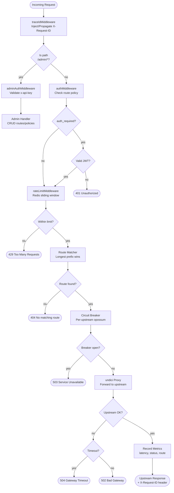
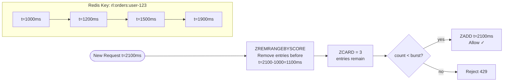
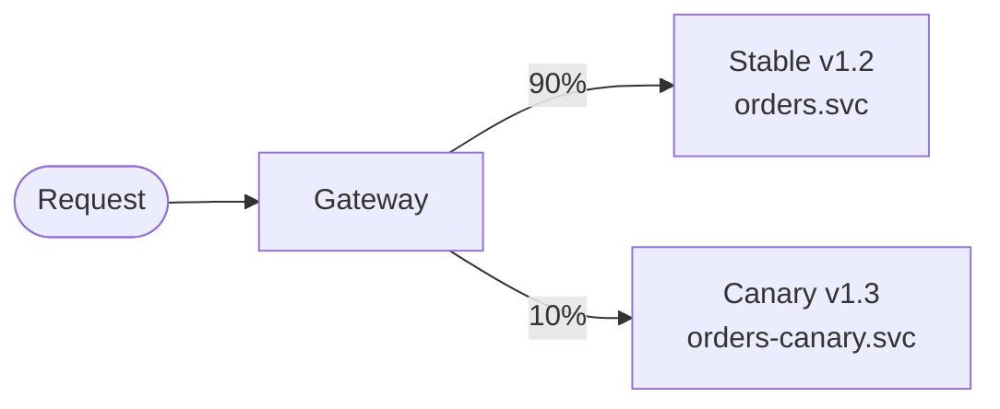

# Request Flow Diagrams

## Middleware Pipeline

Every request through the gateway traverses this pipeline in order:

## Rate Limiting: Sliding Window Algorithm

## Canary / Traffic Splitting (Future)

> Currently behind `FEATURE_CANARY_RELEASES=false` flag.

When enabled, the gateway uses a weighted random selection between upstreams
defined in the route configuration.
